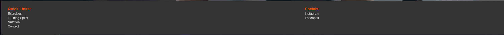

# All Things Gym

<h2><a href="https://linusapelgren.github.io/AllThingsGym/index.html" target="_blank">Deployed site</a></h2>

## Table of contents

- [Introduction](#introduction)
- [Design Planes](#planes)
- [Features](#features)
- [Testing](#testing)
- [Deployment](#deployment)
- [Credits and Outside Sources](#credits)

## Introduction

### Project Description
This is a website that intends to be a hub of information for anyone who is looking to deepen their knowledge about anything training related

### Project Purpose
It intends to teach people everything they need to know to take their training to new heights

### User Demographics
The expected user is anyone with an interest in strenght training and bodybuilding, wheter they are new or already have experience at the gym

### Initial Design
- After i had decided what website i wanted to make, i imediately started experimenting with designing the website
- At first i wanted to make a separate page for every muscle group but i instead opted to having each muscle group listed on the same page to make it easier for the user to find
- I first i designed the contentpage to look like a piece of paper but i changed it to have a more typical look
- I originally just hade a hamburger menu but i changed it to a navigation bar depending on the screen size

## Pages

### Desktop

#### Home page

#### Excersize page

#### Nutrition page

#### Contact page

### Mobile

#### Home page

#### Excersize page

#### Nutrition page

#### Contact page

### Future plans
The site does not provide any written examples of exercises, so that would be one thing i would like to add.

[return to Table of Contents](#toc)

## Features 

### Navigation bar

## Hamburger menu

## Video selector

## Contact form

#### Footer
The footer contains a menu for all the different pages on the site and also links to social media sites. These only go to the main page of the respective social media site. 

[return to Table of Contents](#toc)

## Testing

### Manual Testing
I hosted a live server from my VSCode to test the changes i made, this made it possible to open a tab in my browser and immediatly see the changes i made

### Validation
- HTML
  - No errors were returned when passing through the official [W3C validator](https://validator.w3.org/nu/?doc=https%3A%2F%2Flinusapelgren.github.io%2FGestureGalaxy%2F)
- CSS
  - No errors were found when passing through the official [(Jigsaw) validator](https://jigsaw.w3.org/css-validator/validator?uri=https%3A%2F%2F8000-linusapelgr-gesturegala-5xdeal090og.ws-eu110.gitpod.io%2Findex.html&profile=css3svg&usermedium=all&warning=1&vextwarning=&lang=sv)

[return to Table of Contents](#toc)

## Deployment 
To deploy and view the project do the following steps.

1. Copy/Clone the <a href="https://github.com/linusapelgren/AllThingsGym.git" target="_blank">repository</a> on github.

2. Go to your copy of the repository on your github page (likely `https://github.com/YOUR-USERNAME-HERE/AllThingsGym.git`)

3. Open settings tab on top right of page

4. Click on pages link on the left sidebar in the "Code and Automation" section.

5. Set "Source" to "Deploy from branch", select "main" branch, and set folder to /(root) under "Build and Deployment". Then click Save.

6. Return to the "Code" tab and wait for site to build. Try doing a hard refresh.

7. On the right hand side under "Deployments", click on "github-pages".

8. Click on the link which matches `https://USERNAME.github.io/REPO-NAME/` to view the deployed site.

[return to Table of Contents](#toc)

## Credits and external resources 

#### Images
Images:
1. <a href="https://prod-ne-cdn-media.puregym.com/media/819394/gym-workout-plan-for-gaining-muscle_header.jpg?quality=80&mode=pad&width=992" target="_blank">A man working out using a dumbell</a>
2. <a href="https://www.heartandstroke.ca/-/media/images/get-healthy/eat-variety-healthy-foods-image.jpg" target="_blank">Picture of a plate of food</a>

#### Links to videos used
- <a href="https://www.youtube.com/watch?v=H6mRkx1x77k" target="_blank">The Ultimate Science-Based Leg Day For Muscle Growth (2023)</a>
- <a href="https://www.youtube.com/watch?v=21lYP86dHW4&t=193s" target="_blank">Top 3 Shoulder Exercises For 3D Delts</a>
- <a href="https://www.youtube.com/watch?v=jLvqKgW-_G8" target="_blank">I Ranked Every Back Exercise (Best To Worst)</a>
- <a href="https://www.youtube.com/watch?v=fGm-ef-4PVk" target="_blank">I Ranked Every CHEST Exercise (Best To Worst)</a>
- <a href="https://www.youtube.com/watch?v=Tn-XvYG9x7w&t=81s" target="_blank">How To Get Abs By Summer (Running Out Of Time!)</a>
- <a href="https://www.youtube.com/watch?v=MfMxT_jXcPE" target="_blank">How To Build Huge Forearms: Optimal Training Explained (5 Best Exercises!)</a>

[return to Table of Contents](#toc)